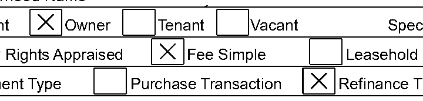
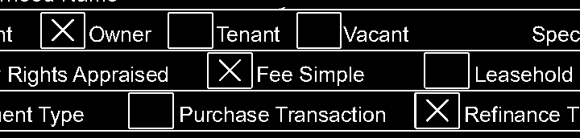
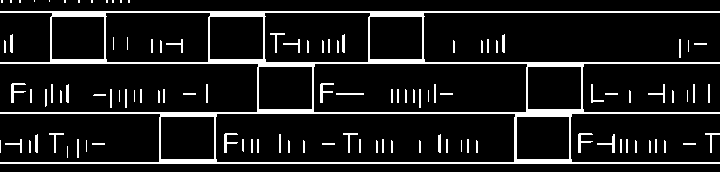
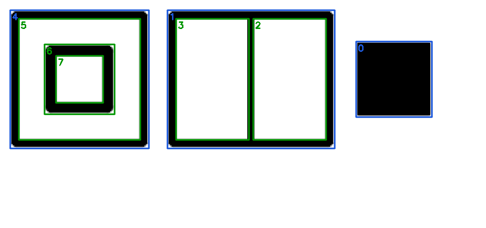
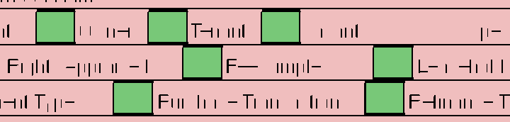
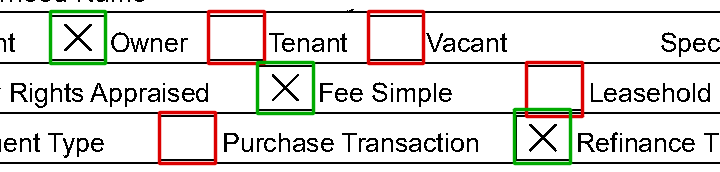

# HomeVision

Detect and annotate checkboxes in document images with a React frontend and a Go/OpenCV backend.

## Run with Docker

Install Docker with Compose (Docker Desktop includes both), then run from this directory:

```sh
docker compose up --build
```

Open http://localhost:5173, choose an image from `backend/testdata`, and click **Detect checkboxes**. The API is also available at http://localhost:8080.

Compose starts two containers: `backend` builds the Go server using a prebuilt OpenCV image, then copies the binary and required shared libraries into Debian slim; `frontend` builds the static files with Node, then serves them with Nginx and forwards `/detect` requests to `http://backend:8080` over Compose's default network. Only Docker is needed locally. The first build downloads dependencies and compiles GoCV, so it can take several minutes; later builds reuse Docker's cache.

Docker serves the production frontend build. For live reload during local development, use `npm run dev` in `frontend` instead. After editing source files, rerun the Compose command to rebuild. Stop with Ctrl+C, then remove the containers with:

```sh
docker compose down
```

The backend uses `linux/amd64` because the upstream ARM OpenCV image crashed during detection on Apple Silicon. Docker Desktop runs it through emulation on those Macs, which makes it slower than a native build.

## How detection works

The detector is classical computer vision with OpenCV, with no trained model. A checkbox is a small, nearly square hole enclosed by straight lines, and each step narrows the image down to that. The images below are a crop of `backend/testdata/sample1-urar-page1.png`.

**1. Grayscale.** The upload is validated and decoded to a single channel.



**2. Adaptive threshold.** Each pixel is compared with its local neighborhood, so ink becomes white and paper black even with uneven scans or shading.



**3. Ruling mask.** Morphological opening with a thin horizontal and a thin vertical kernel keeps only straight runs of at least 12 px. Box borders and table rules survive; text and the diagonal strokes of the X marks fall apart.



**4. Find the holes.** Contours are extracted from the ruling mask together with their hierarchy. OpenCV traces both the outside of every shape and the holes inside it, and records which contour sits inside which:



In the figure, blue contours are outermost and green ones are nested inside another. The empty interior of a box is always a hole in its border, like 5, 7, 3 and 2, while a solid square like 0 has no hole and can never be a checkbox. The detector uses `RETR_CCOMP`, which flattens the tree to two levels, so the outside of a nested shape (6) counts as top level and only holes have a parent. Keeping contours with a parent is what selects the interiors.

Holes are then filtered by size, squareness, rectangularity, and border thickness. Green holes pass; red ones, such as table cells and letter fragments, are rejected:



**5. Classify and clean up.** Each interior is expanded by its measured border to get the outer box, then trimmed slightly and checked against the thresholded image from step 2: if at least 4% of it is ink, the box is checked. Overlapping duplicates are removed and boxes are sorted top to bottom. Below, green is checked and red is unchecked:



Every threshold lives in [`backend/internal/vision/params.go`](backend/internal/vision/params.go) with its rationale, and [docs/decisions.md](docs/decisions.md) covers the tradeoffs.

See [backend/README.md](backend/README.md) and [frontend/README.md](frontend/README.md) for the API, local development, and tests.
